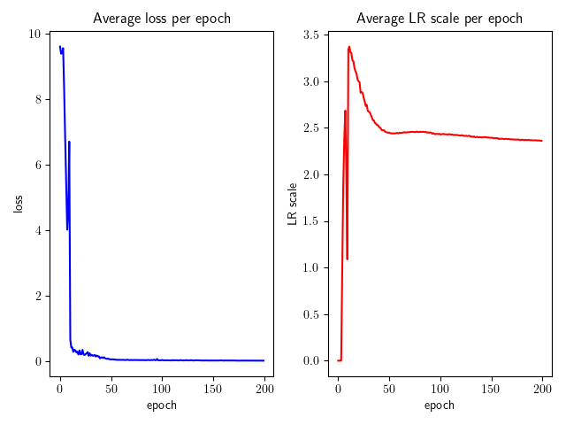

# manic


[](https://codecov.io/gh/dscamiss/manic)

An PyTorch implementation of the Mechanic learning rate scale tuner [1].  

The reference implementation can be found in [this repository](https://github.com/optimizedlearning/mechanic).

## Brief background

Mechanic works alongside an optimizer and learning rate scheduler to tune the learning rate scale.

For concreteness, suppose that the optimizer is vanilla SGD, so that one gradient descent iteration is
$\theta_{t+1} \leftarrow \theta_t - \alpha_t \nabla_\theta L(\theta_t)$, where $\alpha_t$ is the learning rate.  Generally
speaking, the learning rate scheduler needs to be tuned to select the base learning rate.  This amounts to searching 
for a scale factor $\sigma$ such that $\theta_{t+1} \leftarrow \theta_t - \sigma \alpha_t \nabla_\theta L(\theta_t)$ has good convergence 
properties.  The search process is usually *ad hoc* and involves multiple training runs.

In contrast, Mechanic automatically selects the scale factor at each gradient descent iteration.  The selection
process is completely online during training, and comes with fairly strong theoretical guarantees with respect to convergence properties.
The cost is computational overhead, which is not severe since Mechanic is a first-order method 
(it only uses model parameters, gradients, and simple derived quantities).

# Installation

```
git clone https://github.com/dscamiss/manic
pip install manic
```

# Usage

## Setup

```python
from manic import Mechanic, Updater

model = make_model()
optimizer = torch.optim.AdamW(model.parameters(), ...)
lr_scheduler = torch.optim.lr_scheduler.CosineAnnealingLR(optimizer, ...)

updater = Updater(optimizer, lr_scheduler)  # Uses static LR scheduler if `lr_scheduler` is omitted
mechanic = Mechanic(updater)
```

There are no restrictions on the model, optimizer, or learning rate scheduler.

## Training

The `manic` paradigm is

```python
for epoch in range(num_epochs):
    for x, y in dataloader:
        [...]
        loss.backward()
        mechanic.step()
        updater.step()   
```

Note that this is different from the standard paradigm

```python title="Standard method"
for epoch in range(num_epochs):
    for x, y in dataloader:
        [...]
        loss.backward()
        optimizer.step()
    lr_scheduler.step()   
```

## Save/load state

Save state:

```python
updater_state = updater.state_dict()
mechanic_state = mechanic.state_dict()
```

Load state:

```python
# Make optimizer and LR scheduler as above
optimizer = <your-optimizer>
lr_scheduler = <your-LR-scheduler>
updater = Updater(optimizer, lr_scheduler)
mechanic = Mechanic(updater)

# Load saved state dicts
updater.load_state_dict(updater_state)
mechanic.load_state_dict(mechanic_state)
mechanic.optimizer = updater.base_optimizer
```

# Example

This figure shows the convergence of the (average) learning rate scale on a toy example:



The learning rate scale dynamics show the "overshoot then settle" behavior observed in [1].

# TODO

- [x] Add state save/restore
- [ ] Double-check OOO

# References

[1] Ashok Cutkosky, Aaron Defazio, and Harsh Mehta, Mechanic: A Learning Rate Tuner, [arXiv:2306.00144](https://arxiv.org/abs/2306.00144)
